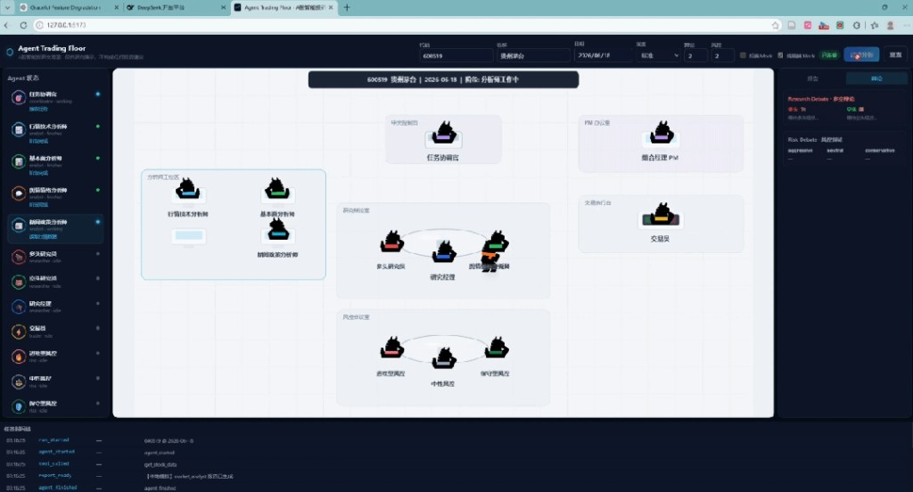
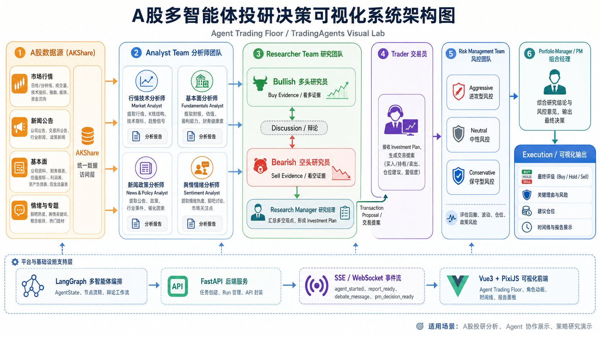

# FinAgent-Lab

**A 股多智能体投研可视化实验室** — 将 LangGraph 多 Agent 分析流程实时映射为 SSE 事件，驱动 Vue + PixiJS 交易大厅动画与报告面板。

> 仅供研究与工程演示，**不构成任何投资建议**。

## 演示预览

<p align="center">
  
</p>

<p align="center"><em>后端 Mock 模式：13 个 Agent 在交易大厅中协作分析 600519 贵州茅台（约 15s / 0 Token）</em></p>

## 系统架构

FinAgent-Lab 将 **A 股数据接入 → 多 Agent 投研决策 → 实时可视化** 串成一条可观测流水线：底层 LangGraph 负责编排与推理，FastAPI 将图执行过程翻译为 SSE 事件，前端用 PixiJS 交易大厅呈现协作过程。

<p align="center">
  
</p>

### 决策流水线（6 个阶段）

| 阶段 | 模块 | 说明 |
|------|------|------|
| 1 | **A 股数据源** | AkShare 统一接入行情、财报、新闻、情绪等数据 |
| 2 | **分析师团队** | 行情技术 / 基本面 / 新闻政策 / 舆情情绪 四类分析师产出报告 |
| 3 | **研究员团队** | 多头 vs 空头辩论，研究经理汇总为投资计划 |
| 4 | **交易员** | 将投资计划转化为交易提案（方向、仓位、置信度） |
| 5 | **风控团队** | 进攻 / 中性 / 保守三方评估回撤、波动与政策风险 |
| 6 | **组合经理 PM** | 综合研究与风控意见，输出最终评级与决策说明 |

### 平台与通信层

```
┌─────────────────────────────────────────────────────────────┐
│  前端  Vue 3 + PixiJS + Pinia                               │
│  Agent 状态栏 · 报告/辩论面板 · 时间线 · PM 决策弹窗        │
└───────────────────────────┬─────────────────────────────────┘
                            │ REST + SSE
┌───────────────────────────▼─────────────────────────────────┐
│  后端  FastAPI + EventBus + StreamEventTranslator             │
│  任务创建 · 15 种事件协议 · 断线 Replay · 后台长任务        │
└───────────────────────────┬─────────────────────────────────┘
                            │ graph.stream
┌───────────────────────────▼─────────────────────────────────┐
│  多智能体引擎  LangGraph · Tool Calling · 多 LLM Provider     │
└─────────────────────────────────────────────────────────────┘
```

前端精灵动画与事件驱动交互受到 [腾讯 Marvis Office](https://github.com/Tencent/marvis-office) 的启发，场景与业务布局独立设计为金融投研作战室。

## 特性

- **13 个 Agent 全链路可视化**：分析师 → 研究辩论 → 交易提案 → 风控辩论 → PM 决策
- **SSE 实时事件流**：15 种统一事件驱动状态栏、报告、辩论与时间线
- **PixiJS 交易大厅**：工位 / 辩论室 / 交易台 / 风控室分区动画与任务交接
- **三档演示模式**：纯前端 Mock、后端 Mock（~15s / 0 Token）、真实 LLM 分析
- **前后端分离**：FastAPI + Vue 3 + TypeScript，Mock 与真实运行共用同一协议

## 仓库结构

```
FinAgent-Lab/
├── backend/          # FastAPI、SSE、LangGraph stream 桥接
├── frontend/         # Vue 3 + PixiJS 可视化
├── docs/             # 使用说明与配图
├── .env.example      # LLM 等环境变量模板
└── README.md
```

## 快速开始

### 环境要求

- Python 3.10+
- Node.js ^20.19 或 >=22.12
- 真实分析：已安装多智能体 LangGraph 引擎 Python 包（见下方说明）

### 1. 后端

```bash
# 克隆后于项目根目录
cp .env.example .env          # 编辑 DEEPSEEK_API_KEY 等

pip install tradingagents     # 多智能体分析引擎（PyPI / 本地 editable 安装均可）
pip install -r backend/requirements.txt

uvicorn backend.main:app --reload --host 127.0.0.1 --port 8000
```

- API 文档：http://127.0.0.1:8000/docs  
- 健康检查：http://127.0.0.1:8000/api/health  

也可将引擎源码置于 `agent-engine/` 后执行 `pip install -e agent-engine`（该目录已 gitignore，不随本仓库发布）。

### 2. 前端

```bash
cd frontend
npm install
npm run dev
```

访问 http://127.0.0.1:5173（`/api` 已代理到后端 8000 端口）。

### 3. 体验流程

1. 打开前端，确认右上角「已连接」
2. 输入股票代码（如 `600519`），可先勾选「后端 Mock」体验完整动画
3. 取消 Mock 并配置 `.env` 中的 LLM Key 后可运行真实分析

更详细说明见 [docs/使用文档.md](docs/使用文档.md)。

## 技术栈

| 层级 | 技术 |
|------|------|
| 后端 | FastAPI · Uvicorn · Pydantic · SSE · asyncio |
| 前端 | Vue 3 · TypeScript · Vite · Pinia · PixiJS |
| Agent | LangGraph · Tool Calling · 多 LLM Provider |
| 数据 | AkShare（A 股行情 / 财报 / 新闻） |

## 文档

- [使用文档](docs/使用文档.md)
- [后端说明](backend/README.md)
- [前端说明](frontend/README.md)

## 免责声明

本仓库输出仅供学术研究、技术演示与工程验证，不构成任何形式的投资建议、荐股或交易指令。股市有风险，投资需谨慎。

## License

MIT
